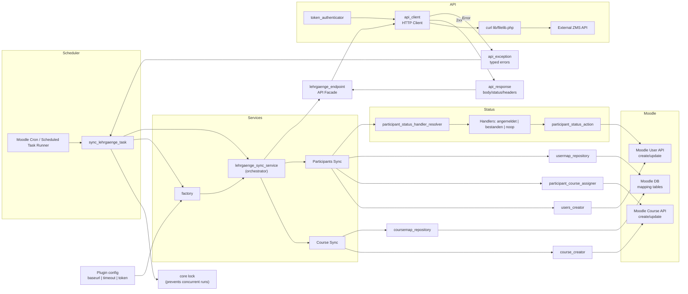

```mermaid
    flowchart LR

    subgraph Scheduler
    Cron["Moodle Cron / Scheduled Task Runner"]
    Task["sync_lehrgaenge_task"]
    end

    Cron --> Task
    Task --> Lock["core lock\n(prevents concurrent runs)"]
    Task --> Factory["factory"]

    Config["Plugin config\nbaseurl | timeout | token"] --> Factory

    subgraph Services
    direction TB
    Factory --> SyncService["lehrgaenge_sync_service\n(orchestrator)"]
    SyncService --> CourseFlow["Course Sync"]
    SyncService --> ParticipantsSyncSvc["Participants Sync"]
    end

    subgraph API
    direction TB
    Auth["token_authenticator"]
    Client["api_client\nHTTP Client"]
    Curl["curl lib/filelib.php"]
    External["External ZMS API"]
    Auth --> Client
    Client --> Curl --> External
    end

    subgraph Moodle
    direction TB
    MoodleDB["Moodle DB\nmapping tables"]
    MoodleCourseAPI["Moodle Course API\ncreate/update"]
    MoodleUserAPI["Moodle User API\ncreate/update"]
    end

    SyncService --> Endpoint["lehrgaenge_endpoint\nAPI Facade"]
    Endpoint --> Client

    CourseFlow --> CourseCreator["course_creator"]
    CourseFlow --> RepoCourse["coursemap_repository"]
    RepoCourse --> MoodleDB
    CourseCreator --> MoodleCourseAPI

    ParticipantsSyncSvc --> UsersCreator["users_creator"]
    ParticipantsSyncSvc --> ParticipantAssigner["participant_course_assigner"]
    ParticipantsSyncSvc --> RepoUser["usermap_repository"]
    RepoUser --> MoodleDB
    UsersCreator --> MoodleUserAPI
    ParticipantAssigner --> MoodleCourseAPI

    subgraph Status
    direction LR
    Resolver["participant_status_handler_resolver"]
    Handlers["Handlers: angemeldet | bestanden | noop"]
    Action["participant_status_action"]
    Resolver --> Handlers --> Action --> MoodleUserAPI
    end

    ParticipantsSyncSvc --> Resolver

    Client -->|2xx| Response["api_response\nbody/status/headers"]
    Client -->|Error| ApiEx["api_exception\ntyped errors"]
    Response --> Endpoint
    ApiEx --> Task

    Task --> SyncService
```