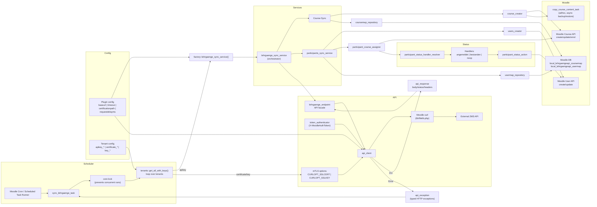

```mermaid
flowchart LR

subgraph Scheduler
Cron["Moodle Cron / Scheduled Task Runner"]
Task["sync_lehrgaenge_task"]
Lock["core lock\n(prevents concurrent runs)"]
TenantLoop["tenants::get_all_with_keys()\nloop over tenants"]
end

Cron --> Task --> Lock --> TenantLoop

subgraph Config
GlobalCfg["Plugin config\nbaseurl | timeout | certificationpath | requestdelayms"]
TenantCfg["Tenant config\napikey_* | certificate_* | key_*"]
end

GlobalCfg --> Factory
TenantCfg --> TenantLoop
TenantLoop -->|apikey| Factory["factory::lehrgaenge_sync_service()"]

subgraph Services
direction TB
SyncService["lehrgaenge_sync_service\n(orchestrator)"]
CourseFlow["Course Sync"]
ParticipantsSyncSvc["participants_sync_service"]
end

Factory --> SyncService
SyncService --> CourseFlow
SyncService --> ParticipantsSyncSvc

subgraph API
direction TB
Endpoint["lehrgaenge_endpoint\nAPI facade"]
Auth["token_authenticator\n(X-MoodleAuthToken)"]
Client["api_client"]
MTLS["mTLS options\nCURLOPT_SSLCERT | CURLOPT_SSLKEY"]
Curl["Moodle curl\n(lib/filelib.php)"]
External["External ZMS API"]
end

SyncService --> Endpoint --> Client
Auth --> Client
GlobalCfg --> Client
TenantLoop -->|certificate/key| MTLS --> Client
Client --> Curl --> External

subgraph Moodle
direction TB
MoodleDB["Moodle DB\nlocal_lehrgaengeapi_coursemap\nlocal_lehrgaengeapi_usermap"]
MoodleCourseAPI["Moodle Course API\ncreate/update/enrol"]
MoodleUserAPI["Moodle User API\ncreate/update"]
Adhoc["copy_course_content_task\n(adhoc, async backup/restore)"]
end

CourseFlow --> CourseCreator["course_creator"]
CourseFlow --> RepoCourse["coursemap_repository"]
RepoCourse --> MoodleDB
CourseCreator --> MoodleCourseAPI
CourseCreator --> Adhoc

ParticipantsSyncSvc --> UsersCreator["users_creator"]
ParticipantsSyncSvc --> ParticipantAssigner["participant_course_assigner"]
ParticipantsSyncSvc --> RepoUser["usermap_repository"]
RepoUser --> MoodleDB
UsersCreator --> MoodleUserAPI
ParticipantAssigner --> MoodleCourseAPI

subgraph Status
direction LR
Resolver["participant_status_handler_resolver"]
Handlers["Handlers:\nangemeldet | bestanden | noop"]
Action["participant_status_action"]
end

ParticipantAssigner --> Resolver --> Handlers --> Action
Action --> MoodleUserAPI

Client -->|2xx| Response["api_response\nbody/status/headers"]
Client -->|Error| ApiEx["api_exception\n(typed HTTP exceptions)"]
Response --> Endpoint
ApiEx --> Task
```